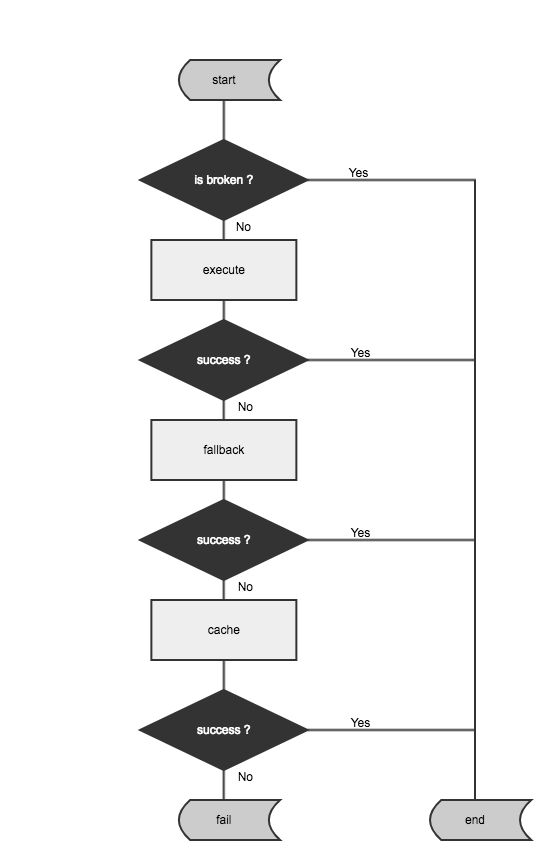
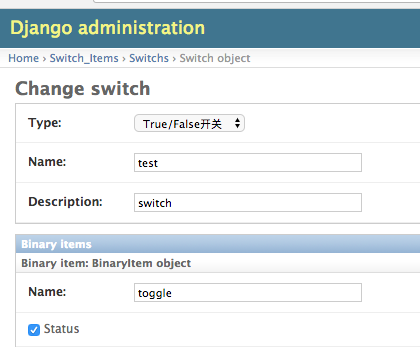

# Tubbe

## Tubbe是什么？

Tubbe是一个定义了统一降级处理流程的库，受Netflix的Hystrix启发，适用于任何远程，服务接口，函数的调用。

## 工作流



## 核心思路

1. 提供了两层降级:
    * 正常->异常
    * 异常->缓存

2. 提供了`validate`接口方法，由使用者定义对返回值的校验及处理方法

3. 以异常为触发降级的基点，系统定义了三种异常（可能会扩展）: `TubbeTimeoutException`, `TubbeCircuitBrokenException`, `TubbeValidationException`，用户抛出的预期内或预期外的异常都会触发降级

4. Command分同步和异步两类，异步通过gevent实现

5. 提供了metrics模块, 用来统计一个请求窗口（Window）内请求成功率和请求数量

6. 提供了熔断模块`CircuitBreaker`, 可以通过实现抽象类自定义熔断方式，也可以使用内置的`NegativeCircuitBreaker`, `PositiveCircuitBreaker`, `DefaultCircuitBreaker`, `SwitchCircuitBreaker`。

   * `DefaultCircuitBreaker`基于`Metrics Counter`实现，可以通过定义时间窗口`Window`的长度，健康阈值`threshold`自动进行熔断。
   * `SwitchCircuitBreaker`基于switch服务 http://switch.intra.yongqianbao.com ，实现了一键熔断的功能。


## Get Started


### Install

```
    pip install tubbe  -i http://pypi.intra.yongqianbao.com --trusted-host pypi.intra.yongqianbao.com
```

### Basic

   见 `examples/demo.py`


### Advance

   见 `examples/quick_fallback.py`

   * 参考下图创建switch开关 
   
